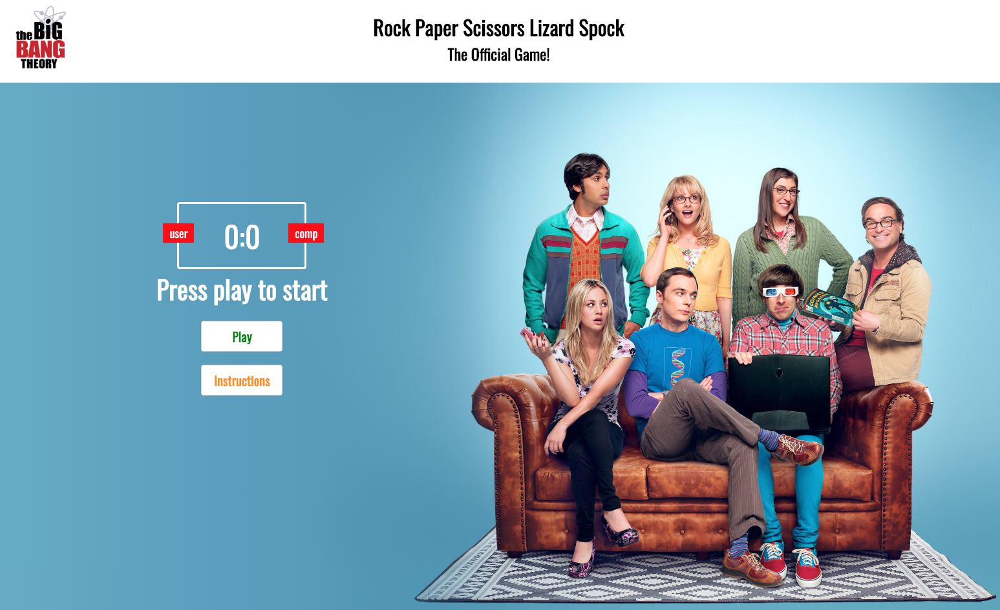

# SEI Hachathon - Rock Paper Scissors Lizard Spock Game from the Big Bang Theory Series - Fan art project

Rock, Paper, Scissors, Lizard, Spock is a variant of the all time famous game Rock, Paper, Scissors. It was introduced in The Big Bang Theory TV-Series. According to the main character, Sheldon Cooper, adding two more options reduces the probability that the game will result in a tie.

See the game online at https://gaebar.github.io/rock-paper-scissors-lizard-spock/index.html

### Timeframe & Team
> 48h, solo

### The Brief
Rock paper scissors is a classic two player game. Each player chooses either rock, paper, or scissors. The items are compared, and whichever player chooses the more powerful item wins. The possible outcomes are: Rock destroys scissors. Scissors cut paper. Paper covers rock. If there’s a tie, then the game ends in a dra
The code will break the game into four parts:

Get the user’s choice. Get the computer’s choice. Compare the two choices and determine a winner. Start the program and display the results.

### Technology

* HTML5
* HTML Audio
* Sass CSS
* Vanilla ES6 JavaScript
* Flexbox
* Git
* GitHub

___

## Game Rules & Instructions
Scissors cut paper. Paper covers rock. Rock crushes lizard. Lizard poisons Spock. Spock smashes scissors. Scissors decapitate lizard. Lizard eats paper. Paper disproves Spock. Spock vaporizes rock. Rock crushes scissors.

* Click Instructions to listen how to play from the voice of Sheldon Cooper
* Click play to start the game versus the computer
* Move the mouse over and choose between one of the 5 icons
* To play again click restart

#### Game Play

The key idea of this program is to generate random numbers in the range (1-5) and equate them to strings "ROCK", "PAPER", "SCISSORS", "LIZARD", and "SPOCK" to numbers respectively and alot this random string to the computer's choice. It is then compared with the user's choice and declare a winner according to the rules above.

#### Game Over

