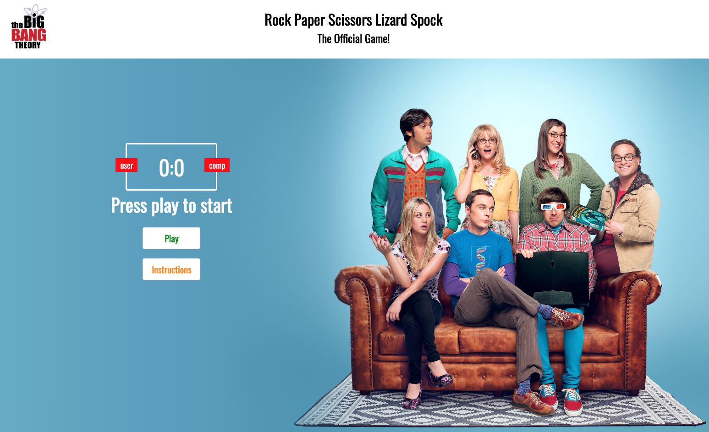

# SEI Hackathon

## Rock Paper Scissors Lizard Spock Game from ``The Big Bang Theory`` series, a fan art project

See the game online at https://gaebar.github.io/rock-paper-scissors-lizard-spock/index.html


### Timeframe & Team
> 48h, solo

### The Brief
Rock paper scissors is a classic two player game. Each player chooses either rock, paper, or scissors. The items are compared, and whichever player chooses the more powerful item wins. The possible outcomes are: Rock destroys scissors. Scissors cut paper. Paper covers rock. If there’s a tie, then the game ends in a dra
The code will break the game into four parts:

Get the user’s choice. Get the computer’s choice. Compare the two choices and determine a winner. Start the program and display the results.

### Technology

* HTML5
* HTML Audio
* Sass CSS
* Vanilla ES6 JavaScript
* Flexbox
* Git
* GitHub

## Game Overview

Rock Paper Scissors Lizard Spock is an extension of the classic game of chance, Rock Paper Scissors, created by Sam Kass and Karen Bryla.

Sam Kass explains he created the expanded game because it seemed like most games of Rock Paper Scissors with people you know would end in a tie.

Rock Paper Scissors Lizard Spock was first mentioned in the Season 2 episode, The Lizard-Spock Expansion, the title of which references the game.

As Sheldon explains, "Scissors cuts paper, paper covers rock, rock crushes lizard, lizard poisons Spock, Spock smashes scissors, scissors decapitates lizard, lizard eats paper, paper disproves Spock, Spock vaporizes rock, and as it always has, rock crushes scissors."

* Click ``Instructions`` to listen to Sheldon Cooper explaining how to play the game
* Click ``Play`` to start a game versus the computer
* Chose one of the five options, and immediately see the result
* Click ``Restart`` to play another game

#### Home Screen




 ### Installation
 This game uses vanilla javascript and ES6 Javascript modules. There is no compilation step, but you might want to install the eslint packages in order to lint the code and check for formatting errors.
 
 Clone this repository:
 
 ``git clone https://github.com/gaebar/eleven-s-game``
 
 Install dependencies:
 
 ``npm install``
 
 Start a local web server in the project root folder:
 
 ``python3 -m http.server``
 
 You should now be able to run the website from http://0.0.0.0:8000/index.html

### Key Learnings
This project was build in 48 hours, and it was one of the first times for me writing more complex vanilla JavaScript code.

I have learned how to use javascript arrays and perform more complex string comparisons, also doing basic DOM manipulation.

### Code Snippets

The key idea of the program is to generate random numbers in the range (1-5) and associate them to the strings "ROCK", "PAPER", "SCISSORS", "LIZARD", and "SPOCK".

```javascript
//select one random option from the array of choices
function getComputerChoice() {
    const choices = ['r', 'p', 's', 'l', 'sp']
    const randomNumber = Math.floor(Math.random() * choices.length)
    return choices[randomNumber]
}
```

I maintain a list of winning, losing and tying combinations, which are checked once the user has made their choice. It is then compared with the user's choice and the result is determined accordingly.

```javascript
// maps the user and computer choices to a result
function game(userChoice) {
    const computerChoice = getComputerChoice()

    switch (userChoice + computerChoice) {
        case 'rs':
        case 'rl':
        case 'sps':
        case 'spr':
       // more cases
        win(userChoice, computerChoice)
        break

        case 'rr':
        case 'pp':
        case 'ss':
        case 'll':
        case 'spsp':
        draw(userChoice, computerChoice)
        break

        default:
        lose(userChoice, computerChoice)
    }
}
```

#### In Game Screen


#### Game Over Screen
 

 ___
 
 ## Future Improvements

 * two players mode
 * better animation while the game in progress
 * a more clear way to display the user and the computer choice

